# Authentication Flow Architecture

## Overview

This document outlines the authentication flow architecture for the Zeneca Mobile application, detailing how we handle user authentication, backend synchronization, and state management.

## End-to-End User Flow

### 1. Initial App Launch Flow


### 2. Authentication Flows

#### 2.1 Sign Up Flow

```mermaid
sequenceDiagram
    participant User
    participant App
    participant Clerk
    participant Backend
    participant Storage

    User->>App: Tap Sign Up
    App->>App: Show Sign Up Form
    User->>App: Enter Details
    App->>Clerk: Create Account
    Clerk-->>App: Account Created
    App->>Clerk: Request Verification
    Clerk->>User: Send Verification Email
    User->>App: Verify Email
    App->>Clerk: Confirm Verification
    Clerk-->>App: Verification Confirmed
    App->>Backend: Create User Profile
    Backend-->>App: Profile Created
    App->>App: Start Onboarding
```


#### 2.2 Login Flow


### 3. Post-Authentication States

```typescript
interface UserSession {
  // Authentication
  authState: AuthenticationState;
  lastAuthenticated: Date;
  
  // User Data
  profile: {
    clerk: ClerkUser;
    backend: BackendUser;
  };
  
  // Session Management
  tokens: {
    auth: string;
    refresh: string;
  };
  
  // App State
  onboardingComplete: boolean;
  lastSyncTimestamp: Date;
  offlineData: {
    timestamp: Date;
    data: any;
  };
}

// State Transitions
const userFlowStates = {
  INITIAL_LAUNCH: {
    next: ['AUTHENTICATING', 'LOGIN_REQUIRED'],
    cleanup: null,
  },
  LOGIN_REQUIRED: {
    next: ['AUTHENTICATING'],
    cleanup: clearSensitiveData,
  },
  AUTHENTICATING: {
    next: ['AUTHENTICATED', 'ERROR'],
    cleanup: null,
  },
  AUTHENTICATED: {
    next: ['SYNCING', 'ONBOARDING', 'READY'],
    setup: initializeUserSession,
  },
  SYNCING: {
    next: ['READY', 'ERROR'],
    setup: syncUserData,
  },
  ONBOARDING: {
    next: ['READY'],
    setup: initializeUserPreferences,
  },
  READY: {
    next: ['LOCKED', 'LOGGED_OUT'],
    setup: startBackgroundSync,
  },
  LOCKED: {
    next: ['READY', 'LOGGED_OUT'],
    cleanup: pauseBackgroundTasks,
  },
  ERROR: {
    next: ['AUTHENTICATING', 'LOGIN_REQUIRED'],
    cleanup: handleError,
  },
};
```

### 4. Session Management

```typescript
const SessionManager = {
  async initialize() {
    // 1. Check for existing session
    const session = await SecureStore.getItemAsync('session');
    if (!session) return false;

    // 2. Validate session with Clerk
    const isValid = await validateClerkSession(session);
    if (!isValid) {
      await this.clearSession();
      return false;
    }

    // 3. Sync with backend
    await this.syncSession();
    return true;
  },

  async syncSession() {
    // 1. Get fresh tokens
    const token = await getClerkToken();
    
    // 2. Fetch latest user data
    const userData = await fetchUserProfile(token);
    
    // 3. Update local storage
    await this.updateLocalData(userData);
    
    // 4. Start background sync
    this.startBackgroundSync();
  },

  async handleBackgroundSync() {
    // 1. Check connection
    if (!await NetInfo.isConnected()) return;
    
    // 2. Sync offline mutations
    await syncOfflineMutations();
    
    // 3. Update local cache
    await updateLocalCache();
  }
};
```

### 5. Error Recovery Flow


### 6. Background Tasks

```typescript
const BackgroundTasks = {
  syncInterval: 5 * 60 * 1000, // 5 minutes
  
  async startBackgroundSync() {
    // 1. Register sync task
    await registerBackgroundTask('sync', async () => {
      await SessionManager.handleBackgroundSync();
    });
    
    // 2. Setup periodic sync
    this.setupPeriodicSync();
    
    // 3. Setup connectivity listener
    this.setupConnectivityListener();
  },
  
  async setupPeriodicSync() {
    setInterval(async () => {
      if (await NetInfo.isConnected()) {
        await SessionManager.handleBackgroundSync();
      }
    }, this.syncInterval);
  },
  
  setupConnectivityListener() {
    NetInfo.addEventListener(async (state) => {
      if (state.isConnected) {
        await SessionManager.handleBackgroundSync();
      }
    });
  }
};
```

### 7. Data Flow and Caching Strategy

```typescript
const DataManager = {
  async handleDataSync() {
    const queryClient = useQueryClient();
    
    // 1. Critical data (always sync)
    const criticalQueries = ['user', 'settings'];
    
    // 2. Important data (sync if changed)
    const importantQueries = ['preferences', 'recent-activity'];
    
    // 3. Regular data (periodic sync)
    const regularQueries = ['history', 'saved-items'];
    
    // Sync strategy
    await Promise.all([
      ...criticalQueries.map(q => queryClient.prefetchQuery(q)),
      ...importantQueries.map(q => queryClient.invalidateQueries(q)),
      ...regularQueries.map(q => queryClient.refetchQueries(q))
    ]);
  }
};
```

## Application Routes Structure

```
app/
├── _layout.tsx                 # Root layout with auth protection
├── index.tsx                   # Public landing page
├── login.tsx                   # Login screen
├── signup.tsx                  # Signup screen
├── email-signup.tsx           # Email signup flow
├── verify/
│   └── [email].tsx            # Email verification
├── (authenticated)/           # Protected routes group
│   ├── _layout.tsx            # Auth layout with additional protection
│   ├── home.tsx               # Main authenticated home
│   └── modals/               # Modal screens
│       └── lock.tsx          # Lock screen
└── (onboarding)/             # Onboarding flow group
    ├── _layout.tsx           # Onboarding layout
    └── steps/                # Onboarding steps
```

## Current Implementation

### Authentication Provider
- Uses Clerk (`@clerk/clerk-expo`) as the primary authentication provider
- Handles basic auth operations (sign-in, sign-up, session management)
- Provides auth state through `useAuth` hook

Current implementation in `_layout.tsx`:
```typescript
const InitialLayout = () => {
  const { isLoaded, isSignedIn } = useAuth();
  const segments = useSegments();
  const router = useRouter();

  useEffect(() => {
    if (!isLoaded) return;

    const inAuthGroup = segments[0] === '(authenticated)';
    
    if (isSignedIn && !inAuthGroup) {
      router.replace('/(authenticated)/modals/lock');
    } else if (!isSignedIn && inAuthGroup) {
      router.replace('/');
    }
  }, [isSignedIn]);
  // ... rest of the implementation
};
```

## Enhanced Architecture

### 1. Authentication States

```typescript
enum AuthenticationState {
  INITIAL = 'INITIAL',
  AUTHENTICATING = 'AUTHENTICATING',
  AUTHENTICATED = 'AUTHENTICATED',
  UNAUTHENTICATED = 'UNAUTHENTICATED',
  ERROR = 'ERROR',
  SYNCING = 'SYNCING',
  ONBOARDING = 'ONBOARDING'
}

interface AuthenticationStatus {
  state: AuthenticationState;
  error?: Error;
  lastSync?: Date;
  isOnline?: boolean;
}
```

### 1.1 Login/Logout Flow

#### Login Implementation
```typescript
const useAuth = () => {
  const { signIn } = useClerk();
  const { setClerkUser, setBackendUser, setSyncStatus } = useUserStore();
  const queryClient = useQueryClient();

  const login = async (credentials: LoginCredentials) => {
    try {
      setSyncStatus('authenticating');
      
      // 1. Authenticate with Clerk
      const result = await signIn.create({
        identifier: credentials.email,
        password: credentials.password,
      });

      // 2. Get session token
      const token = await result.createdSessionId;
      
      // 3. Fetch user data from backend
      const backendUser = await fetchUserFromBackend(token);
      
      // 4. Update stores
      setClerkUser(result.user);
      setBackendUser(backendUser);
      setSyncStatus('authenticated');

      // 5. Prefetch critical data
      await queryClient.prefetchQuery(['user-preferences']);
      await queryClient.prefetchQuery(['user-settings']);

      return result;
    } catch (error) {
      setSyncStatus('error');
      throw new AuthError('Login failed', error.code);
    }
  };

  return { login };
};
```

#### Logout Implementation
```typescript
const useLogout = () => {
  const { signOut } = useClerk();
  const { resetStore } = useUserStore();
  const queryClient = useQueryClient();
  const router = useRouter();

  const logout = async () => {
    try {
      // 1. Sign out from Clerk
      await signOut();

      // 2. Clear local storage
      await SecureStore.deleteItemAsync('auth_token');
      
      // 3. Reset stores
      resetStore();
      
      // 4. Clear query cache
      queryClient.clear();

      // 5. Clear offline cache
      await AsyncStorage.removeItem('ZENECA_OFFLINE_CACHE');

      // 6. Navigate to login
      router.replace('/login');
    } catch (error) {
      console.error('Logout failed:', error);
      // Even if some cleanup fails, ensure user is logged out
      router.replace('/login');
    }
  };

  return { logout };
};
```

#### State Management During Auth Flow
```typescript
const AuthStateManager = {
  handleAuthStateChange: (state: AuthenticationState) => {
    switch (state) {
      case 'AUTHENTICATING':
        // Show loading UI
        // Disable interactions
        break;
        
      case 'AUTHENTICATED':
        // Start backend sync
        // Prefetch critical data
        // Enable offline support
        break;
        
      case 'UNAUTHENTICATED':
        // Clear sensitive data
        // Reset stores
        // Navigate to login
        break;
        
      case 'ERROR':
        // Show error UI
        // Provide retry option
        break;
        
      case 'SYNCING':
        // Show sync indicator
        // Queue offline operations
        break;
        
      case 'ONBOARDING':
        // Start onboarding flow
        // Track completion
        break;
    }
  }
};
```

#### Usage Example
```typescript
const LoginScreen = () => {
  const { login } = useAuth();
  const { authState } = useUserStore();

  const handleLogin = async (credentials: LoginCredentials) => {
    try {
      await login(credentials);
      
      // After successful login, check if user needs onboarding
      if (needsOnboarding) {
        router.replace('/(onboarding)');
      } else {
        router.replace('/(authenticated)/home');
      }
    } catch (error) {
      // Handle specific error cases
      switch (error.code) {
        case 'invalid_credentials':
          showErrorMessage('Invalid email or password');
          break;
        case 'network_error':
          showErrorMessage('Please check your connection');
          break;
        default:
          showErrorMessage('An error occurred');
      }
    }
  };

  return (
    <View>
      {authState === 'AUTHENTICATING' && <LoadingSpinner />}
      {/* Login form */}
    </View>
  );
};
```

### 2. User Store Implementation

```typescript
interface UserState {
  clerkUser: ClerkUser | null;
  backendUser: BackendUser | null;
  syncStatus: SyncStatus;
  error: Error | null;
  lastSync: Date | null;
  isOnboarded: boolean;
  preferences: UserPreferences;
}

// Zustand Store Implementation
interface UserStore extends UserState {
  setClerkUser: (user: ClerkUser | null) => void;
  setBackendUser: (user: BackendUser | null) => void;
  setSyncStatus: (status: SyncStatus) => void;
  setError: (error: Error | null) => void;
  resetStore: () => void;
}

const useUserStore = create<UserStore>((set) => ({
  clerkUser: null,
  backendUser: null,
  syncStatus: 'idle',
  error: null,
  lastSync: null,
  isOnboarded: false,
  preferences: {},
  
  setClerkUser: (user) => set({ clerkUser: user }),
  setBackendUser: (user) => set({ backendUser: user }),
  setSyncStatus: (status) => set({ syncStatus: status }),
  setError: (error) => set({ error }),
  resetStore: () => set(initialState)
}));
```

### 3. Authentication Hook Implementation

```typescript
const useAuthSync = () => {
  const { isSignedIn, getToken } = useAuth();
  const { setBackendUser, setSyncStatus, setError } = useUserStore();
  const queryClient = useQueryClient();

  const syncUser = async () => {
    try {
      setSyncStatus('syncing');
      const token = await getToken();
      
      // Backend API call
      const response = await axios.get('/api/user/profile', {
        headers: { Authorization: `Bearer ${token}` }
      });
      
      setBackendUser(response.data);
      setSyncStatus('success');
      
      // Invalidate relevant queries
      queryClient.invalidateQueries(['user']);
      
    } catch (error) {
      setSyncStatus('error');
      setError(error as Error);
      
      // Error handling strategy
      if (isNetworkError(error)) {
        // Handle offline scenario
      } else if (isAuthError(error)) {
        // Handle auth errors
      }
    }
  };

  // Auto-sync on auth state change
  useEffect(() => {
    if (isSignedIn) {
      syncUser();
    }
  }, [isSignedIn]);

  return { syncUser };
};
```

### 4. Protected Route Implementation

```typescript
const AuthGuard: FC = ({ children }) => {
  const { isSignedIn, isLoaded } = useAuth();
  const { backendUser, syncStatus } = useUserStore();
  const segments = useSegments();
  const router = useRouter();

  useEffect(() => {
    if (!isLoaded) return;

    const inAuthGroup = segments[0] === '(authenticated)';
    const inOnboardingGroup = segments[0] === '(onboarding)';
    
    if (isSignedIn) {
      // Handle different authenticated states
      if (!backendUser && !inOnboardingGroup) {
        router.replace('/(onboarding)');
      } else if (backendUser && !inAuthGroup) {
        router.replace('/(authenticated)/home');
      }
    } else if (!isSignedIn && (inAuthGroup || inOnboardingGroup)) {
      router.replace('/');
    }
  }, [isSignedIn, backendUser, segments]);

  if (!isLoaded) return <LoadingScreen />;
  
  return <>{children}</>;
};
```

### 5. Error Handling Implementation

```typescript
class AuthError extends Error {
  constructor(
    message: string,
    public code: string,
    public httpStatus?: number
  ) {
    super(message);
    this.name = 'AuthError';
  }
}

const handleAuthError = (error: AuthError) => {
  switch (error.code) {
    case 'token_expired':
      return handleTokenExpired();
    case 'invalid_token':
      return handleInvalidToken();
    case 'network_error':
      return handleNetworkError();
    default:
      return handleGenericError(error);
  }
};
```

### 6. Offline Support Implementation

```typescript
const useOfflineSupport = () => {
  const queryClient = useQueryClient();

  // Configure offline persistence
  useEffect(() => {
    const persister = createAsyncStoragePersister({
      storage: AsyncStorage,
      key: 'ZENECA_OFFLINE_CACHE'
    });

    // Handle offline mutations
    onlineManager.setEventListener((online) => {
      if (online) {
        // Sync offline mutations
        queryClient.resumePausedMutations();
      }
    });
  }, []);
};
```

## State Flow Diagrams

### Authentication State Machine


### Data Sync Flow


## Implementation Steps

### Phase 1: Core Authentication
1. Set up Clerk provider
```typescript
const RootLayout = () => {
  return (
    <ClerkProvider publishableKey={env.CLERK_PUBLISHABLE_KEY}>
      <AuthProvider>
        <App />
      </AuthProvider>
    </ClerkProvider>
  );
};
```

2. Implement auth guards
```typescript
const AuthProvider = ({ children }) => {
  const { isLoaded, isSignedIn } = useAuth();
  const { syncUser } = useAuthSync();

  useEffect(() => {
    if (isSignedIn) {
      syncUser();
    }
  }, [isSignedIn]);

  return <>{children}</>;
};
```

### Phase 2: Backend Integration
1. Create API client
2. Implement token management
3. Add error handling

### Phase 3: State Management
1. Configure offline support
2. Implement caching strategy
3. Add sync mechanisms

### Phase 4: Advanced Features
1. Add biometric authentication
2. Implement secure storage
3. Add analytics and monitoring

## Testing Strategy

### Unit Tests Example
```typescript
describe('AuthGuard', () => {
  it('redirects to onboarding for new users', () => {
    const { result } = renderHook(() => useAuth());
    
    // Test implementation
  });

  it('handles offline mode correctly', () => {
    // Test implementation
  });
});
```

### Integration Tests Example
```typescript
describe('Authentication Flow', () => {
  it('completes full auth cycle', async () => {
    // Test implementation
  });
});
```

## Monitoring Implementation

```typescript
const AuthMetrics = {
  trackAuthAttempt: () => {
    Analytics.track('auth_attempt');
  },
  
  trackAuthSuccess: () => {
    Analytics.track('auth_success');
  },
  
  trackSyncComplete: () => {
    Analytics.track('sync_complete');
  }
};
```

## Security Considerations

### Token Storage
```typescript
const SecureTokenStorage = {
  async storeToken(token: string): Promise<void> {
    await SecureStore.setItemAsync('auth_token', token);
  },
  
  async getToken(): Promise<string | null> {
    return await SecureStore.getItemAsync('auth_token');
  }
};
```

### Biometric Authentication
```typescript
const BiometricAuth = {
  async authenticate(): Promise<boolean> {
    const compatible = await LocalAuthentication.hasHardwareAsync();
    if (!compatible) return false;
    
    const result = await LocalAuthentication.authenticateAsync();
    return result.success;
  }
};
```

## References

1. [Clerk Documentation](https://clerk.dev/docs)
2. [Expo Router Documentation](https://expo.github.io/router/docs)
3. [React Query Documentation](https://tanstack.com/query/latest)
4. [Security Best Practices](https://owasp.org/www-project-mobile-top-10/)
5. [Offline First Architecture](https://offline-first.org/) 