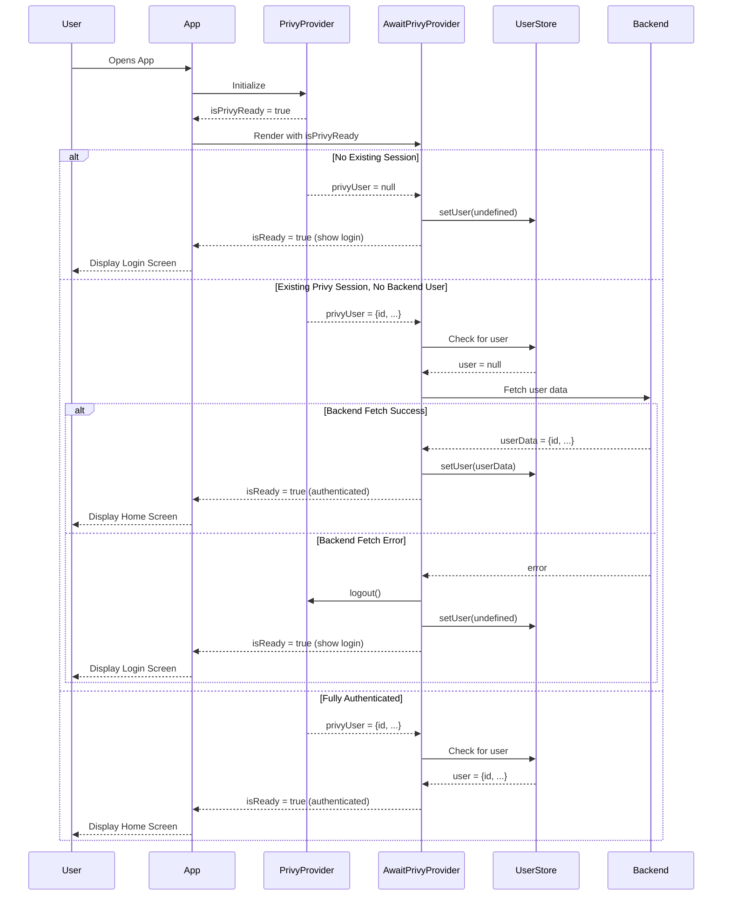
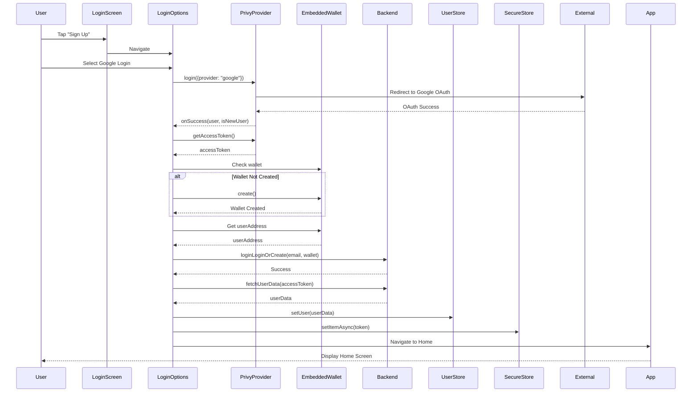
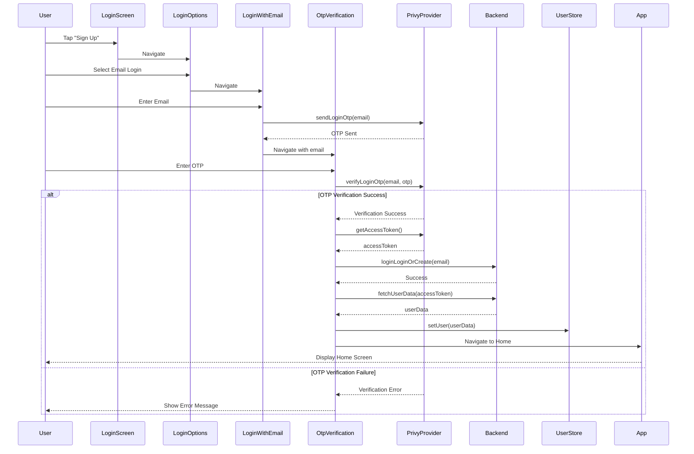
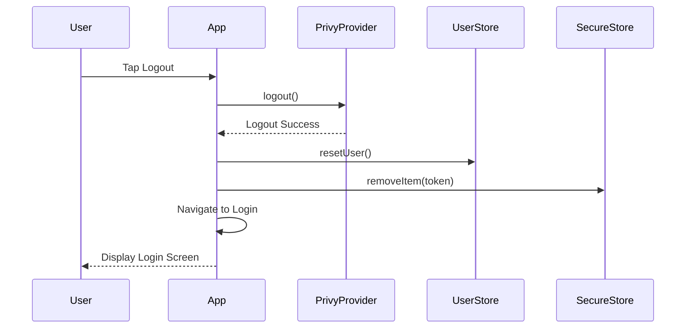
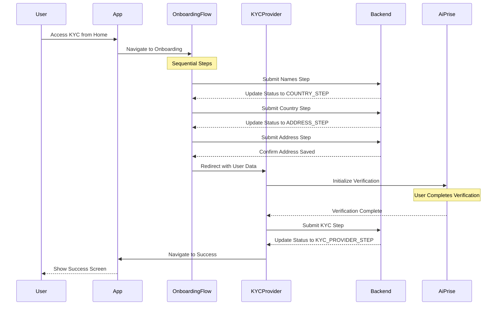

# Authentication Flow Analysis Document
## 1. Authentication Architecture Overview

The application implements a multi-layered authentication system with the following components:

### 1.1 Authentication Providers

- **Privy Authentication** (`@privy-io/expo`): Primary authentication provider that handles OAuth and email-based authentication
  - Provides `isReady`, `user`, `login`, and `logout` functionality
  - Manages authentication state and user identity
  - Uses a custom secure storage adapter for token persistence

- **Backend Authentication**: Secondary verification with the app's backend API
  - Validates Privy user with backend and creates/retrieves app-specific user profile
  - Uses TanStack Query for data fetching and caching
  - Stores authentication token for API requests

- **Local State Management**: Zustand store for persisting user state
  - Persists authenticated user data across app sessions
  - Provides actions for setting, fetching, and resetting user
  - Uses secure storage for sensitive data

### 1.2 Authentication Flow Layers

1. **Privy Authentication Layer**:
   - Handles OAuth (Google) and email authentication
   - Manages authentication tokens and user identity
   - Provides authentication state through React context

2. **Backend Verification Layer**:
   - Validates Privy user with backend API
   - Creates or retrieves app-specific user profile
   - Establishes session with backend services
   - Stores authentication token for subsequent API requests

3. **Local State Persistence**:
   - Stores authenticated user data in Zustand store
   - Persists authentication state across app sessions
   - Provides user data to components throughout the app

## 2. Authentication Components and Their Roles

### 2.1 Core Authentication Components

#### 2.1.1 `AwaitPrivyProvider` Component

- **Location**: `src/components/AwaitPrivyProvider.tsx`
- **Purpose**: Acts as a gatekeeper for the entire app
- **Implementation Details**:
  - Uses React's `useState` and `useEffect` hooks for state management
  - Depends on Privy's `isReady`, `user`, and `logout` functionality
  - Uses TanStack Query for backend user data fetching
  - Manages synchronization between Privy and backend authentication
- **Behavior**:
  - Shows loading animation (`LogoAnimation`) until authentication state is determined
  - Only renders children when authentication state is resolved (`isReady: true`)
  - Manages synchronization between Privy and backend authentication
  - Forces logout on backend authentication errors
  - Uses complex conditional logic with multiple dependencies
- **Key State Variables**:
  - `isReady`: Boolean indicating if authentication state is resolved
  - `isPrivyReady`: Boolean from Privy indicating if it has initialized
  - `privyUser`: Privy user object if authenticated
  - `user`: Backend user object from store
  - `shouldFetchUser`: Condition to fetch backend user (`!!privyUser && !user && isPrivyReady`)

#### 2.1.2 `useUserStore` Zustand Store

- **Location**: `src/storage/userStore.ts`
- **Purpose**: Manages user state persistence
- **Implementation Details**:
  - Uses Zustand with persist middleware
  - Stores data in secure storage
  - Provides typed interface for user data and actions
- **Features**:
  - Persists user data in secure storage
  - Provides actions for setting, fetching, and resetting user
  - Handles loading and error states
  - Integrates with TanStack Query for data fetching
- **Key Actions**:
  - `setUser`: Updates user data in store
  - `resetUser`: Clears user data from store
  - `fetchUser`: Fetches user data from backend
  - `setLoading` and `setError`: Manage loading and error states

### 2.2 Authentication Flow Providers

#### 2.2.1 `PrivyProvider` Component

- **Location**: Used in `src/components/Providers.tsx`
- **Purpose**: Provides Privy authentication context
- **Implementation Details**:
  - Wraps the entire app to provide authentication context
  - Configured with app ID and client ID from environment variables
  - Uses custom secure storage adapter
- **Configuration**:
  - Uses custom secure storage adapter (`MyPermissiveSecureStorageAdapter`)
  - Configured with app ID and client ID from environment variables
  - Supports multiple blockchain chains (sepolia, baseSepolia, base)
- **Provided Context**:
  - `isReady`: Boolean indicating if Privy has initialized
  - `user`: Privy user object if authenticated
  - `login`: Function to initiate authentication
  - `logout`: Function to end authentication session

#### 2.2.2 `PersistQueryClientProvider` Component

- **Location**: Used in `src/components/Providers.tsx`
- **Purpose**: Persists API query state
- **Implementation Details**:
  - Uses TanStack Query with AsyncStorage persister
  - Resumes paused mutations on success
  - Invalidates queries after resuming
- **Features**:
  - Persists query cache in AsyncStorage
  - Throttles persistence operations (1000ms)
  - Resumes paused mutations on success
  - Invalidates queries after resuming
- **Configuration**:
  - Uses AsyncStorage for persistence
  - Throttles persistence operations (1000ms)
  - Configured to resume paused mutations and invalidate queries on success

## 3. Authentication Screens and Routes

### 3.1 Authentication Screen Flow

#### 3.1.1 Login Screen

- **Location**: `src/screens/Login/Login.tsx`
- **Route**: `Login`
- **Purpose**: Entry point for authentication
- **Implementation Details**:
  - Simple UI with branding and login button
  - Uses React Navigation for routing
  - Styled with NativeWind (Tailwind for React Native)
- **Features**:
  - Displays app branding and description
  - Provides button to navigate to login options
  - Uses internationalization for text content

#### 3.1.2 Login Options Screen

- **Location**: `src/screens/Login/LoginOptions.tsx`
- **Route**: `LoginOptions`
- **Purpose**: Provides authentication method options
- **Implementation Details**:
  - Uses Privy's `useLoginWithOAuth` and `useEmbeddedWallet` hooks
  - Handles wallet creation and connection
  - Manages authentication state with useState
  - Makes API calls to backend for user creation/verification
- **Features**:
  - Email login option
  - Google OAuth login option
  - Handles Privy authentication
  - Creates backend user after successful Privy authentication
  - Stores authentication token in secure storage
  - Handles wallet creation and connection
  - Navigates to Home screen on success

#### 3.1.3 Email Login Screen

- **Location**: `src/screens/Login/LoginWithEmail.tsx`
- **Route**: `LoginWithEmail`
- **Purpose**: Handles email-based authentication
- **Implementation Details**:
  - Form for email input
  - Validates email format
  - Initiates email OTP flow

#### 3.1.4 OTP Verification Screen

- **Location**: `src/screens/Login/LoginOtpVerification.tsx`
- **Route**: `EmailOtpValidation`
- **Purpose**: Verifies email OTP for authentication
- **Implementation Details**:
  - OTP input interface
  - Validates OTP with Privy
  - Handles success and error states

### 3.2 Navigation Structure

#### 3.2.1 Main Navigation

- **Location**: `src/screens/MainNavigation.tsx`
- **Purpose**: Defines the app's navigation structure
- **Implementation Details**:
  - Uses React Navigation's Native Stack Navigator
  - Conditionally sets initial route based on authentication state
  - Groups screens by functionality
  - Defines screen options and header configurations
- **Features**:
  - Conditional initial route based on authentication state (`!user ? "Login" : "Home"`)
  - Groups screens by functionality (Login, Home, ETF, etc.)
  - Defines screen options and header configurations
  - Handles back navigation and profile button
  - Configures screen transitions and animations

## 4. Authentication Flow Process

### 4.1 Initial App Load

1. App starts with `AppIndex` component in `src/index.tsx`
2. Loads fonts and hides splash screen
3. Sets up navigation container and providers:
   - `NavigationContainer`: Provides navigation context
   - `Providers`: Sets up all app providers
   - `StatusBar`: Configures status bar
   - `MainNavigation`: Defines navigation structure
4. Within `Providers`, the following are initialized:
   - `GestureHandlerRootView`: For gesture handling
   - `PrivyProvider`: For authentication
   - `PostHogProvider`: For analytics
   - `SafeAreaProvider`: For safe area handling
   - `BottomSheetModalProvider`: For bottom sheets
   - `WagmiProvider`: For blockchain integration
   - `PersistQueryClientProvider`: For query persistence
   - `AwaitPrivyProvider`: For authentication state management

### 4.2 Authentication State Resolution

1. `AwaitPrivyProvider` initializes with `isReady: false`
2. Waits for Privy to be ready (`isPrivyReady`)
3. Once Privy is ready, checks for Privy user:
   - If no Privy user: Sets `isReady: true`, clears user store, shows login screens
   - If Privy user exists: Checks for backend user in store
   - If both exist: Sets `isReady: true`, shows authenticated screens
   - If Privy user exists but no backend user: Fetches from backend API
4. The component uses a complex `useEffect` with multiple dependencies:
   ```typescript
   useEffect(() => {
     if (!isPrivyReady) return;

     // Not authenticated if no privyUser
     if (!privyUser) {
       setUser(undefined);
       setIsReady(true);
       return;
     }

     // Already authenticated if both exist
     if (privyUser && user) {
       setIsReady(true);
       return;
     }

     // fetch user again if we are authenticated
     if (userData) {
       setUser(userData);
       setIsReady(true);
       return;
     }

     // Handle error case - clear user and logout
     if (error) {
       setUser(undefined);
       handleLogout()
       setIsReady(true);
       return;
     }

     // If we have privyUser but no user data, trigger fetch
     if (shouldFetchUser) {
       refetch();
     }
   }, [
     isPrivyReady,
     privyUser,
     user,
     userData,
     error,
     shouldFetchUser,
     setUser,
     logout
   ]);
   ```

### 4.3 Backend User Verification

1. Fetches user data from backend using TanStack Query:
   ```typescript
   const {
     data: userData,
     error,
     refetch
   } = useQuery({
     ...usersMeOptions({ client }),
     enabled: shouldFetchUser,
     retry: 1
   });
   ```
2. On success: Sets user in store, sets `isReady: true`
3. On error: Clears user store, logs out from Privy, sets `isReady: true`
4. Error handling is implemented with a callback:
   ```typescript
   const handleLogout = useCallback(async () => {
     console.error(
       "Error fetching user data from backend",
       privyUser?.id,
       "\nPerforming Privy Logout\n",
       error
     );
     await logout();
   }, [privyUser?.id, error, logout]);
   ```

### 4.4 User Login Process

1. User navigates to `LoginOptions` screen
2. Selects authentication method (email or Google)
3. For Google OAuth:
   - Calls Privy's `login({ provider: "google" })`
   - On success, creates/retrieves backend user:
     ```typescript
     await loginLoginOrCreate({
       headers: {
         Authorization: `Bearer ${accessToken}`,
       },
       body: {
         email: account.email,
         has_third_party_auth: true,
         wallet: {
           address: userAddress as `0x${string}`,
           smart_account_address: smartAccount?.account
             ?.address as `0x${string}`,
         },
       },
     });
     ```
   - Stores authentication token in secure storage:
     ```typescript
     await SecureStore.setItemAsync(`token-${userAddress}`, accessToken!);
     ```
   - Navigates to `Home` screen
4. For Email:
   - Navigates to `LoginWithEmail` screen
   - User enters email
   - Navigates to `EmailOtpValidation` for verification
   - On success, follows similar backend verification process

### 4.5 Authentication Flow Sequence Diagrams

#### 4.5.1 App Initialization and Authentication Check



#### 4.5.2 Google OAuth Login Flow



#### 4.5.3 Email Login Flow



#### 4.5.4 Logout Flow



## 5. Authentication State Management

### 5.1 State Variables and Conditions

- `isPrivyReady`: Indicates if Privy has initialized
- `privyUser`: Privy user object if authenticated
- `user`: Backend user object from store
- `isReady`: Indicates if authentication state is resolved
- `shouldFetchUser`: Condition to fetch backend user (`!!privyUser && !user && isPrivyReady`)
- `userData`: Backend user data from API
- `error`: Error from backend API call

### 5.2 State Transitions

1. **Initial State**: `isReady: false`, showing loading animation
   - App starts with `AwaitPrivyProvider` showing `LogoAnimation`
   - Waits for Privy to initialize (`isPrivyReady`)

2. **Unauthenticated State**: `isReady: true`, `privyUser: null`, `user: null`
   - Privy is ready but no user is authenticated
   - Shows login screens
   - User can initiate authentication

3. **Partially Authenticated State**: `isReady: false`, `privyUser: exists`, `user: null`
   - User authenticated with Privy but not yet with backend
   - Fetching user data from backend
   - Still showing loading animation

4. **Fully Authenticated State**: `isReady: true`, `privyUser: exists`, `user: exists`
   - User authenticated with both Privy and backend
   - Shows authenticated screens
   - User can access protected features

5. **Error State**: `isReady: true`, `privyUser: null`, `user: null` (after logout)
   - Error occurred during backend authentication
   - Forced logout from Privy
   - Shows login screens
   - No specific error feedback to user

## 6. Authentication Issues and Challenges

### 6.1 Current Implementation Issues

1. **Boolean State Limitation**:
   - Using `isReady` boolean doesn't capture all authentication states
   - No distinction between different authentication phases
   - Limited ability to show appropriate UI for each state

2. **Error Handling**:
   - Forces logout on any backend error without retry options
   - No distinction between different types of errors (network, validation, server)
   - Limited error reporting (only console.error)
   - No user feedback for authentication failures

3. **Race Conditions**:
   - Complex effect dependencies could lead to race conditions
   - Multiple return statements in effect make flow hard to follow
   - No clear state machine for transitions

4. **Tight Coupling**:
   - Authentication logic tightly coupled with provider component
   - Direct dependencies on Privy and user store
   - Limited separation of concerns

5. **Limited User Feedback**:
   - No specific error messaging or recovery options
   - Only shows `LogoAnimation` for all non-ready states
   - No progress indicators for authentication steps

### 6.2 Edge Cases Not Handled Well

1. **Network Failures**:
   - No specific handling for network failures vs. authentication failures
   - No retry mechanism for transient network issues
   - Forces logout on any backend error

2. **Token Expiration**:
   - No clear token refresh mechanism
   - No handling of token expiration during app use
   - No automatic re-authentication

3. **Partial Authentication**:
   - Limited handling of state where Privy succeeds but backend fails
   - No recovery path except full re-authentication
   - No preservation of authentication progress

4. **Concurrent Authentication**:
   - No protection against concurrent authentication attempts
   - No locking mechanism during authentication process
   - Potential for race conditions with multiple auth attempts

5. **App Backgrounding**:
   - No specific handling for authentication during app backgrounding
   - Potential for interrupted authentication flows
   - No resumption of authentication process

## 7. Route Protection and Navigation

### 7.1 Current Route Protection

- Initial route in `MainNavigation` is conditionally set based on user state:
  ```typescript
  <Stack.Navigator initialRouteName={!user ? "Login" : "Home"}>
  ```
- No explicit route protection for authenticated routes
- No prevention of direct navigation to protected routes
- Navigation after authentication handled in login components
- No deep linking protection

### 7.2 Navigation After Authentication Events

- After successful login: Navigates to `Home` screen
  ```typescript
  navigation.navigate("Home");
  ```
- After logout: `AwaitPrivyProvider` sets `isReady: true` with no user, showing login screens
- No preservation of intended destination after authentication
- No handling of deep links that require authentication

## 8. Authentication Data Flow

### 8.1 Data Flow During Login

1. User credentials → Privy Authentication
   - User provides credentials (email, Google account)
   - Privy handles authentication and returns user object

2. Privy token → Backend Authentication
   - Privy provides access token
   - Token used for backend API authentication
   - Backend validates token and creates/retrieves user

3. Backend user data → User Store
   - Backend returns user data
   - Data stored in Zustand store
   - Token stored in secure storage

4. Authentication state → Navigation
   - Authentication state updated
   - Navigation redirects to authenticated routes
   - User can access protected features

### 8.2 Data Flow During Logout

1. Logout action → Privy logout
   - User initiates logout or error forces logout
   - Privy logout called to end session

2. Privy logout → Clear user store
   - Privy session ended
   - User store reset to initial state
   - Token removed from secure storage

3. Clear user store → Navigation to login screens
   - Authentication state updated
   - Navigation redirects to login screens
   - User sees unauthenticated UI

## 9. Recommendations for Improvement

Based on the analysis, the authentication system would benefit from:

1. **State Machine Implementation**:
   - Replace boolean `isReady` with explicit authentication states
   - Define clear state transitions
   - Handle each state with appropriate UI
   - Example states: INITIALIZING, UNAUTHENTICATED, AUTHENTICATING, AUTHENTICATED, ERROR

2. **Centralized Authentication Context**:
   - Extract authentication logic from `AwaitPrivyProvider`
   - Create dedicated AuthContext
   - Provide authentication state and methods
   - Simplify component dependencies

3. **Improved Error Handling**:
   - Add retry mechanisms for recoverable errors
   - Categorize errors (network, authentication, server)
   - Provide specific error messaging
   - Implement Sentry integration for error reporting

4. **Token Management**:
   - Implement proper token refresh mechanism
   - Handle token expiration gracefully
   - Store tokens securely with encryption
   - Implement proper cleanup on logout

5. **Protected Route Component**:
   - Create a dedicated component for route protection
   - Check authentication state before rendering
   - Redirect unauthenticated users to login
   - Preserve intended destination

6. **Consistent Navigation**:
   - Standardize navigation after authentication events
   - Handle deep linking properly
   - Implement navigation guards
   - Preserve navigation state during authentication

7. **User Feedback**:
   - Improve loading and error states with clear user feedback
   - Show progress indicators for authentication steps
   - Provide recovery options for authentication failures
   - Implement proper error messages

8. **Testing and Validation**:
   - Implement unit tests for authentication components
   - Test all authentication scenarios
   - Validate state transitions
   - Test edge cases like network failures and token expiration

These improvements would create a more robust, maintainable, and user-friendly authentication system that handles edge cases properly and provides a better user experience.

## 10. Wallet Integration Analysis

### 10.1 Wallet Architecture Overview

The application implements a wallet system deeply integrated with the authentication flow, using the following components:

- **Privy Embedded Wallet**: Primary wallet provider that creates and manages user wallets
  - Provided by `@privy-io/expo` package
  - Creates non-custodial wallets tied to user authentication
  - Manages wallet state and provider access

- **Smart Account Integration**: Account abstraction layer built on top of EOA wallets
  - Uses Permissionless.js library for smart account creation
  - Implements Simple Account standard (ERC-4337)
  - Provides gasless transactions through Pimlico paymaster

- **Blockchain Integration**: Multi-chain support through Wagmi and Viem
  - Configured for multiple networks (Sepolia, Base Sepolia, Base)
  - Provides RPC connections and transaction handling
  - Manages wallet connections to blockchain networks

### 10.2 Wallet Creation and Management Flow

#### 10.2.1 Wallet Creation During Authentication

The wallet creation process is tightly coupled with the authentication flow:

1. **Authentication Initiation**:
   - User authenticates via Privy (Google OAuth or email)
   - Privy creates a user identity

2. **Embedded Wallet Creation**:
   - After successful authentication, the app checks for an existing wallet
   - If no wallet exists, it creates a new embedded wallet:
     ```typescript
     if (isNotCreated(wallet)) {
       await wallet.create!();
     }
     ```
   - The wallet is non-custodial and controlled by the user

3. **Smart Account Creation**:
   - After wallet creation, a smart account is created:
     ```typescript
     const smartAccount = await getPimlicoSmartAccountClient(
       userAddress as `0x${string}`,
       chain,
       wallet,
     );
     ```
   - Uses the embedded wallet as the owner/signer
   - Creates a counterfactual smart account address

4. **Backend Registration**:
   - Both the EOA wallet address and smart account address are registered with the backend:
     ```typescript
     await loginLoginOrCreate({
       // ...
       body: {
         email: account.email,
         has_third_party_auth: true,
         wallet: {
           address: userAddress as `0x${string}`,
           smart_account_address: smartAccount?.account?.address as `0x${string}`,
         },
       },
     });
     ```
   - Links the wallet addresses to the user profile

#### 10.2.2 Wallet Provider Implementation

The wallet provider is implemented using Privy's embedded wallet:

1. **Provider Initialization**:
   - Initialized in the `Providers` component with Privy configuration
   - Configured with app ID and client ID from environment variables
   - Uses custom secure storage adapter for key persistence

2. **Wallet State Management**:
   - Managed through `useEmbeddedWallet` hook
   - Provides wallet state and methods for wallet operations
   - Handles wallet creation, connection, and signing

3. **Provider Access**:
   - Access to the wallet provider is abstracted through utility functions:
     ```typescript
     const walletClient = getWalletClient(address, chain, wallet);
     ```
   - Provides standardized interface for wallet operations

### 10.3 Smart Account Integration

The application uses account abstraction to enhance user experience:

#### 10.3.1 Smart Account Creation

1. **Smart Account Factory**:
   - Uses a deployed factory contract to create smart accounts
   - Implements the Simple Account standard (ERC-4337)
   - Creates counterfactual addresses before deployment

2. **Smart Account Client**:
   - Created using Permissionless.js library:
     ```typescript
     return createSmartAccountClient({
       account: simpleAccount,
       entryPoint: entryPoint07Address,
       chain: currentEnv.CHAIN,
       bundlerTransport: http(currentEnv.PAYMASTER),
       middleware: {
         gasPrice: async () => (await pimlicoBundlerClient().getUserOperationGasPrice()).fast,
         sponsorUserOperation: paymasterClient().sponsorUserOperation,
       },
     });
     ```
   - Configures bundler and paymaster for transaction handling
   - Provides methods for sending transactions

3. **Transaction Handling**:
   - Transactions are sent through the smart account client
   - Bundled and sponsored by Pimlico services
   - Allows for gasless transactions and batched operations

#### 10.3.2 Wallet Signer Implementation

The application implements custom signers to bridge between Privy and Viem:

1. **Light Signer**:
   - Implements a minimal signer interface for message signing:
     ```typescript
     export const getLightSigner = (
       address: string,
       chain: Chain,
       provider: PrivyEmbeddedWalletProvider,
     ) => {
       return {
         async getAddress() {
           return address!;
         },
         async signMessage(message: string) {
           // Implementation
         },
       };
     };
     ```
   - Used for simple signing operations

2. **Wallet Client**:
   - Creates a Viem wallet client from the Privy provider:
     ```typescript
     export const getWalletClient = (
       ownerAddress: string,
       chain: Chain,
       wallet: EmbeddedWalletState,
     ) => {
       return createWalletClient({
         account: ownerAddress as `0x${string}`,
         chain,
         transport: custom({
           async request({ method, params }) {
             return (await wallet.getProvider!()).request({ method, params });
           },
         }),
       });
     };
     ```
   - Bridges between Privy's provider interface and Viem's wallet client
   - Handles RPC method forwarding

### 10.4 Wallet-Authentication Relationship

The relationship between wallet and authentication is bidirectional:

#### 10.4.1 Authentication-to-Wallet Flow

1. **Identity-First Approach**:
   - Authentication establishes user identity first
   - Wallet is created/connected after successful authentication
   - Wallet is tied to the authenticated user identity

2. **Wallet Creation Trigger**:
   - Triggered in the `handleConnection` function after authentication
   - Only proceeds if authentication is successful
   - Creates wallet if it doesn't exist

3. **Session Management**:
   - Authentication session and wallet session are managed together
   - Logout clears both authentication and wallet state
   - Re-authentication reconnects to existing wallet

#### 10.4.2 Wallet-to-Backend Synchronization

1. **Wallet Registration**:
   - Wallet addresses are registered with backend during authentication
   - Both EOA and smart account addresses are stored
   - Backend maintains the association between user and wallets

2. **Token Storage**:
   - Authentication token is stored with wallet address as key:
     ```typescript
     await SecureStore.setItemAsync(`token-${userAddress}`, accessToken!);
     ```
   - Creates a link between authentication token and wallet

3. **User Profile Update**:
   - User profile is updated with wallet information
   - Enables wallet-based features and permissions
   - Allows for wallet-based authentication in future sessions

### 10.5 Security Considerations

The wallet integration includes several security considerations:

#### 10.5.1 Key Management

1. **Secure Storage**:
   - Private keys are stored in device secure storage
   - Uses `MyPermissiveSecureStorageAdapter` for Privy integration
   - Implements platform-specific secure storage mechanisms

2. **Non-Custodial Design**:
   - User maintains control of their private keys
   - Keys never leave the device
   - Application cannot access raw private keys

3. **Recovery Mechanisms**:
   - Relies on Privy's recovery mechanisms
   - Tied to authentication method (email, Google)
   - No separate seed phrase management

#### 10.5.2 Transaction Security

1. **Signature Verification**:
   - All transactions require user signature
   - Signatures are verified on-chain
   - Smart account enforces owner authorization

2. **Smart Contract Security**:
   - Uses audited smart account implementations
   - Follows ERC-4337 standard for account abstraction
   - Implements counterfactual addresses for security

3. **RPC Security**:
   - Uses secure RPC endpoints
   - Implements proper error handling for RPC calls
   - Validates responses from RPC providers

#### 10.5.3 Authentication-Wallet Binding

1. **Strict Binding**:
   - Wallet is strictly bound to authenticated user
   - Cannot use wallet without authentication
   - Authentication state controls wallet access

2. **Token Security**:
   - Authentication tokens stored with wallet address as key
   - Tokens stored in secure storage
   - Token access requires device access

3. **Session Management**:
   - Wallet session tied to authentication session
   - Logout clears both sessions
   - Re-authentication required for wallet access

### 10.6 Wallet Integration Challenges

The current wallet integration faces several challenges:

1. **Complex Dependency Chain**:
   - Relies on multiple libraries (Privy, Viem, Permissionless.js)
   - Version compatibility issues between libraries
   - Complex upgrade path for wallet components

2. **Error Handling Limitations**:
   - Limited error handling for wallet creation failures
   - No clear recovery path for wallet creation errors
   - Minimal user feedback for wallet-related errors

3. **Network Dependency**:
   - Smart account creation requires network connectivity
   - No offline wallet creation capability
   - Limited caching of wallet state

4. **Cross-Platform Considerations**:
   - Different secure storage implementations across platforms
   - Performance variations between iOS and Android
   - Platform-specific wallet behavior

5. **Upgrade Path Challenges**:
   - Wallet upgrades tied to authentication system
   - Complex migration path for wallet changes
   - Backward compatibility concerns for wallet formats

### 10.7 Recommendations for Wallet Integration

Based on the analysis, the wallet integration would benefit from:

1. **Decoupled Wallet Creation**:
   - Separate wallet creation from authentication flow
   - Allow for retry mechanisms for wallet creation
   - Implement progressive wallet creation with better feedback

2. **Enhanced Error Handling**:
   - Implement specific error handling for wallet operations
   - Provide clear user feedback for wallet errors
   - Add recovery mechanisms for wallet creation failures

3. **Offline Capabilities**:
   - Implement offline wallet creation capability
   - Cache wallet state for offline use
   - Synchronize wallet state when online

4. **Improved Security Model**:
   - Enhance key management with additional security layers
   - Implement transaction confirmation UI
   - Add spending limits and security policies

5. **Monitoring and Analytics**:
   - Add monitoring for wallet creation success rates
   - Track wallet usage patterns
   - Implement analytics for wallet operations

These improvements would create a more robust, user-friendly wallet system that handles edge cases properly and provides a better user experience while maintaining strong security.

## 11. KYC Verification Flow

### 11.1 KYC Architecture Overview

The application implements a structured Know Your Customer (KYC) verification system that integrates with the authentication flow, using the following components:

- **Onboarding State Management**: Tracks user progress through the KYC process
  - Uses Zustand store (`useKYCStatusStore`) for state persistence
  - Defines clear onboarding status progression
  - Manages KYC verification status separately from authentication

- **Third-Party KYC Provider**: AiPrise integration for identity verification
  - Embedded via `AiPriseFrame` component
  - Handles document scanning and verification
  - Provides callbacks for success and failure scenarios

- **Backend Verification Layer**: API endpoints for KYC status management
  - Validates and updates user KYC status
  - Enforces sequential progression through onboarding steps
  - Stores verification results and status

### 11.2 KYC Status and States

#### 11.2.1 Onboarding Status Progression

The KYC flow follows a defined progression of states:

1. **NAMES_STEP**: Initial step collecting user's first and last name
2. **COUNTRY_STEP**: Collection of user's country information
3. **ADDRESS_STEP**: Collection of detailed address information
4. **KYC_PROVIDER_STEP**: Integration with third-party KYC provider

These states are defined in an enum:
```typescript
export enum OnboardingStatus {
    NAMES_STEP = "NAMES_STEP",
    COUNTRY_STEP = "COUNTRY_STEP",
    ADDRESS_STEP = "ADDRESS_STEP",
    KYC_PROVIDER_STEP = "KYC_PROVIDER_STEP",
}
```

#### 11.2.2 KYC Verification Status

Separate from onboarding status, the application tracks KYC verification status:

```typescript
interface KYCStatusState {
  obStatus?: OnboardingStatus;
  kycStatus?: KYCStatus;
  isVerifying: boolean;
  isVerified: boolean;
}
```

The `kycStatus` can be one of the following (from the API types):
- `NOT_STARTED`: User has not begun KYC verification
- `IN_PROGRESS`: User has started but not completed verification
- `PENDING_REVIEW`: Verification submitted and awaiting review
- `APPROVED`: Verification approved
- `REJECTED`: Verification rejected

### 11.3 KYC Flow Components

#### 11.3.1 Onboarding Component

- **Location**: `src/screens/OnBoarding/OnBoarding.tsx`
- **Purpose**: Manages the overall onboarding flow including KYC
- **Implementation Details**:
  - Uses step-based navigation through the onboarding process
  - Maintains form state across multiple steps
  - Handles API mutations for each step
  - Determines current step based on user's onboarding status
- **Key Features**:
  - Progressive form validation
  - Step-by-step navigation
  - Form data persistence
  - API integration for each step

#### 11.3.2 KYC Redirect Step

- **Location**: `src/components/Onboarding/KYCRedirectStep.tsx`
- **Purpose**: Transitions from onboarding to KYC verification
- **Implementation Details**:
  - Simple component that automatically navigates to KYC provider
  - Passes collected user information to KYC provider
  - Acts as a bridge between onboarding and KYC verification
- **Behavior**:
  - Automatically navigates to KYC provider when mounted
  - Passes address and country information to KYC provider
  - Minimal UI as it's primarily a transition component

#### 11.3.3 KYC Provider Component

- **Location**: `src/screens/KYCVerification/KYCProvider.tsx`
- **Purpose**: Integrates with third-party KYC service
- **Implementation Details**:
  - Embeds AiPrise SDK for identity verification
  - Configures verification with user data
  - Handles verification callbacks
  - Updates backend on successful verification
- **Key Features**:
  - Third-party SDK integration
  - Callback handling for verification outcomes
  - Backend status updates
  - Navigation to success screen on completion

#### 11.3.4 KYC Success Component

- **Location**: `src/screens/KYCVerification/KYCSuccess.tsx`
- **Purpose**: Confirms successful KYC submission
- **Implementation Details**:
  - Simple success screen with navigation back to home
  - Provides user feedback on verification submission
  - Completes the KYC flow
- **Behavior**:
  - Displays success message
  - Provides button to return to home screen
  - Indicates that verification is being processed

### 11.4 KYC State Management

#### 11.4.1 KYC Status Store

The application uses a dedicated Zustand store for KYC status management:

```typescript
export const useKYCStatusStore = create<KYCStatusStore>()(
  devtools(
    persist(
      (set, get) => ({
        ...initialState,
        setObStatus: (status: OnboardingStatus) =>
          set(() => ({
            obStatus: status,
            isVerifying: status === "KYC_PROVIDER_STEP",
          })),
        setKycStatus: (status: KYCStatus) =>
          set(() => ({
            kycStatus: status,
            isVerified: status !== "NOT_STARTED",
          })),
        reset: () => set(initialState),
      }),
      {
        name: "kyc-status-storage",
        storage: createJSONStorage(() => zustandStorage),
      },
    ),
  ),
);
```

This store:
- Persists KYC status across app sessions
- Provides actions for updating status
- Tracks verification state with boolean flags
- Integrates with secure storage

#### 11.4.2 KYC Transition State Machine

The application implements a mini-state machine for KYC transitions:

```typescript
interface KYCTransitionState {
  status: 'idle' | 'verifying' | 'ready' | 'redirecting' | 'completing' | 'submitting' | 'error';
  error: Error | null;
  retryCount: number;
  canProceedToKYC: boolean;
  
  // Actions
  startVerification: () => void;
  handleVerificationSuccess: () => void;
  handleVerificationFailure: (error: Error) => void;
  redirectToKYC: () => void;
  completeKYC: (data: any) => void;
  submitKYCData: (data: any) => Promise<void>;
  retry: () => void;
}
```

This state machine:
- Manages the transition to KYC verification
- Handles verification status checks
- Implements retry logic with exponential backoff
- Provides error handling and recovery

### 11.5 KYC Integration with Authentication

#### 11.5.1 Authentication-to-KYC Relationship

The relationship between authentication and KYC is sequential:

1. **Authentication First**: User must be authenticated before KYC
   - Authentication establishes user identity
   - Creates user profile in backend
   - Enables access to KYC flow

2. **KYC as Extended Verification**: KYC extends the authentication
   - Builds on established user identity
   - Adds regulatory compliance
   - Enhances user profile with verified information

3. **Progressive Access Model**: Access to features based on verification level
   - Basic features available after authentication
   - Advanced features require KYC completion
   - Regulatory features require KYC approval

#### 11.5.2 User Profile Enhancement

KYC verification enhances the authenticated user profile:

1. **Profile Data Enrichment**:
   - Adds verified name, address, and identity information
   - Links government-issued ID to user profile
   - Establishes regulatory compliance status

2. **Status Tracking**:
   - Updates user profile with verification status
   - Tracks verification progress
   - Records verification timestamps

3. **Feature Access Control**:
   - Enables conditional feature access based on KYC status
   - Implements regulatory compliance gates
   - Provides progressive user experience

### 11.6 KYC Flow Process

#### 11.6.1 Complete KYC Flow Sequence

The complete KYC flow follows this sequence:

1. **Entry Point**: User accesses KYC flow from home screen
   - Via `VerifyCTACard` component
   - Based on current onboarding status
   - With appropriate entry point based on progress

2. **KYC Preview**: Introduction to KYC process
   - Explains purpose and requirements
   - Provides terms and conditions
   - Initiates onboarding flow

3. **Onboarding Steps**: Sequential data collection
   - Names Step: First and last name
   - Country Step: Country selection
   - Address Step: Detailed address information

4. **KYC Redirect**: Transition to verification provider
   - Validates onboarding status
   - Prepares data for verification
   - Navigates to KYC provider

5. **KYC Verification**: Third-party verification
   - Document scanning and validation
   - Facial recognition (if applicable)
   - Identity verification

6. **Backend Update**: Status update on completion
   - Updates onboarding status to `KYC_PROVIDER_STEP`
   - Sets KYC status to `PENDING_REVIEW`
   - Invalidates and refreshes user data

7. **Success Confirmation**: Completion feedback
   - Confirms submission
   - Explains next steps
   - Returns to main application flow

#### 11.6.2 KYC Flow Sequence Diagram



### 11.7 KYC Status Effect on User Experience

#### 11.7.1 Feature Access Control

KYC status directly affects user access to features:

1. **Unauthenticated**: No access to any features
2. **Authenticated, No KYC**: Limited access to basic features
3. **KYC In Progress**: Access to intermediate features
4. **KYC Approved**: Full access to all features
5. **KYC Rejected**: Limited access with remediation options

#### 11.7.2 UI Adaptations Based on KYC Status

The UI adapts based on KYC status:

1. **Status Indicators**:
   - Verification badges in profile
   - Status indicators in relevant screens
   - Progress indicators during verification

2. **Feature Visibility**:
   - Conditional rendering of features
   - Disabled states for unavailable features
   - Explanatory messaging for locked features

3. **Remediation Paths**:
   - Retry options for failed verification
   - Alternative verification methods
   - Support contact for verification issues

### 11.8 KYC Data Storage and Security

#### 11.8.1 Data Storage Approach

KYC data is handled with specific security considerations:

1. **Minimized Local Storage**:
   - Only status information stored locally
   - No sensitive verification documents stored on device
   - Verification handled by third-party provider

2. **Backend Security**:
   - Encrypted storage of verification status
   - Compliance with data protection regulations
   - Secure API endpoints for status updates

3. **Third-Party Integration**:
   - AiPrise handles document storage and processing
   - Compliant with regulatory requirements
   - Secure data transmission protocols

#### 11.8.2 Privacy Considerations

The KYC implementation addresses privacy concerns:

1. **Data Minimization**:
   - Collects only necessary information
   - Clear purpose specification
   - Limited retention periods

2. **User Consent**:
   - Explicit consent for verification
   - Clear terms and conditions
   - Transparent data usage explanation

3. **Data Access Controls**:
   - Restricted access to verification data
   - Audit trails for data access
   - Secure API authentication

### 11.9 KYC Implementation Challenges

The current KYC implementation faces several challenges:

1. **Complex State Management**:
   - Multiple stores tracking related states
   - Potential for state synchronization issues
   - Complex state transitions

2. **Error Handling Limitations**:
   - Limited error recovery options
   - Minimal user feedback for errors
   - Retry mechanisms not fully implemented

3. **Offline Considerations**:
   - KYC requires network connectivity
   - No offline data collection capability
   - Limited caching of verification status

4. **User Experience Gaps**:
   - Limited guidance during verification
   - Minimal progress indication
   - Limited feedback on verification status

5. **Integration Complexity**:
   - Dependency on third-party service
   - Complex configuration requirements
   - Limited fallback options

### 11.10 Recommendations for KYC Flow Improvement

Based on the analysis, the KYC flow would benefit from:

1. **Unified State Machine**:
   - Implement a comprehensive state machine for the entire KYC flow
   - Define clear states and transitions
   - Provide better error recovery paths

2. **Enhanced User Guidance**:
   - Add detailed instructions for verification
   - Implement progress indicators
   - Provide estimated completion time

3. **Improved Error Handling**:
   - Implement specific error messages
   - Add retry mechanisms with clear feedback
   - Provide alternative verification paths

4. **Offline Support**:
   - Enable offline data collection for onboarding steps
   - Implement data synchronization when online
   - Provide clear offline limitations

5. **Status Monitoring**:
   - Add real-time status updates
   - Implement webhook notifications for status changes
   - Provide estimated processing times

These improvements would create a more robust, user-friendly KYC verification flow that handles edge cases properly and provides a better user experience while maintaining strong security and compliance.

## 12. Comparison with Industry Best Practices

This section compares the application's authentication implementation against industry best practices from authoritative sources such as OWASP, NIST, and OAuth 2.0 standards.

### 12.1 Multi-Factor Authentication Implementation

#### 12.1.1 Industry Best Practices

- **NIST Recommendations**: NIST SP 800-63B recommends multi-factor authentication (MFA) using at least two different authentication factors (something you know, something you have, something you are).
- **OWASP Guidelines**: OWASP recommends not relying solely on biometrics and ensuring that biometric authentication is paired with another factor.
- **Industry Trends**: Modern authentication systems are moving away from password-only authentication toward more secure MFA implementations.

#### 12.1.2 Current Implementation Assessment

- **Strengths**:
  - The application implements OAuth-based authentication through Privy, which supports multiple authentication methods.
  - Email-based OTP verification provides a second factor for email authentication.
  - Google OAuth integration leverages Google's own MFA implementation.

- **Gaps**:
  - No explicit support for hardware security keys (FIDO2/WebAuthn).
  - Limited options for second-factor authentication beyond email OTP.
  - No risk-based authentication that adjusts security requirements based on context.

### 12.2 Token Management and Security

#### 12.2.1 Industry Best Practices

- **OWASP Recommendations**: Tokens should be securely stored, have appropriate expiration, and be properly validated.
- **NIST Guidelines**: Authentication tokens should be generated using cryptographically secure random number generators and have sufficient entropy.
- **OAuth 2.0 Best Practices**: For mobile applications, the Authorization Code Flow with PKCE should be used instead of the Implicit Flow.

#### 12.2.2 Current Implementation Assessment

- **Strengths**:
  - Uses secure storage (SecureStore) for token persistence.
  - Implements token-based authentication with the backend.
  - Stores tokens with wallet address as key, creating a binding between authentication and wallet.

- **Gaps**:
  - No clear token refresh mechanism documented.
  - Limited handling of token expiration scenarios.
  - No explicit implementation of PKCE for the OAuth flow, which is recommended for mobile applications.
  - No documented token revocation process for compromised tokens.

### 12.3 Secure Storage Implementation

#### 12.3.1 Industry Best Practices

- **OWASP Mobile Top 10**: Recommends using platform-specific secure storage mechanisms like Keychain (iOS) or Keystore (Android).
- **NIST Guidelines**: Sensitive authentication data should be encrypted at rest using approved algorithms.
- **Industry Standards**: Keys and tokens should be stored in hardware-backed secure storage when available.

#### 12.3.2 Current Implementation Assessment

- **Strengths**:
  - Uses Expo SecureStore for sensitive data storage.
  - Implements a custom secure storage adapter (`MyPermissiveSecureStorageAdapter`) for Privy integration.
  - Persists authentication state in secure storage.

- **Gaps**:
  - The `MyPermissiveSecureStorageAdapter` name suggests potential security compromises for compatibility.
  - No documented encryption strategy for stored authentication data.
  - No clear distinction between storage strategies for different platforms (iOS vs Android).

### 12.4 Authentication State Management

#### 12.4.1 Industry Best Practices

- **OWASP Recommendations**: Authentication state should be clearly defined and managed securely.
- **Industry Standards**: State machines or similar patterns should be used to manage complex authentication flows.
- **Mobile Best Practices**: Authentication state should be resilient to app backgrounding and process termination.

#### 12.4.2 Current Implementation Assessment

- **Strengths**:
  - Uses Zustand for state management with persistence.
  - Implements clear separation between authentication providers.
  - Handles synchronization between Privy and backend authentication.

- **Gaps**:
  - Uses boolean flags (`isReady`) instead of explicit state machine.
  - Complex conditional logic in `useEffect` hooks creates potential for race conditions.
  - Limited handling of edge cases like network failures during authentication.
  - No clear strategy for handling authentication during app backgrounding.

### 12.5 Biometric Authentication Usage

#### 12.5.1 Industry Best Practices

- **NIST Guidelines**: Biometrics should only be used as part of multi-factor authentication, not as the sole factor.
- **OWASP Recommendations**: Biometric verification should happen on secure hardware when available.
- **Industry Standards**: Biometric authentication should have fallback mechanisms for accessibility.

#### 12.5.2 Current Implementation Assessment

- **Strengths**:
  - Biometric authentication is implemented through Privy's integration with platform capabilities.
  - Not used as the sole authentication factor.
  - Provides alternative authentication methods.

- **Gaps**:
  - No documented validation that biometric verification occurs on secure hardware.
  - Limited documentation on how biometric data is handled and secured.
  - No explicit fallback mechanisms documented for biometric failures.

### 12.6 OAuth Implementation

#### 12.6.1 Industry Best Practices

- **OAuth 2.0 Standards**: Mobile apps should use Authorization Code Flow with PKCE.
- **OWASP Recommendations**: OAuth implementations should validate tokens, check scopes, and implement proper state validation.
- **Industry Standards**: OAuth flows should be secured against common attacks like CSRF and token interception.

#### 12.6.2 Current Implementation Assessment

- **Strengths**:
  - Uses Privy's OAuth implementation, which abstracts many security concerns.
  - Implements Google OAuth for social login.
  - Validates authentication with backend after OAuth completion.

- **Gaps**:
  - No explicit documentation of PKCE implementation.
  - Limited details on how OAuth state is validated to prevent CSRF attacks.
  - No clear documentation on scope validation for OAuth tokens.
  - No explicit handling of OAuth redirect interception attacks.

### 12.7 Error Handling and Security

#### 12.7.1 Industry Best Practices

- **OWASP Recommendations**: Authentication errors should be handled securely without revealing sensitive information.
- **NIST Guidelines**: Failed authentication attempts should be rate-limited to prevent brute force attacks.
- **Industry Standards**: Authentication systems should provide clear error messages to users without exposing implementation details.

#### 12.7.2 Current Implementation Assessment

- **Strengths**:
  - Implements error handling for authentication failures.
  - Logs errors for debugging purposes.
  - Forces logout on backend authentication errors to maintain security.

- **Gaps**:
  - Limited error categorization (network, authentication, server).
  - No documented rate limiting for failed authentication attempts.
  - Error messages are primarily for debugging (console.error) with limited user feedback.
  - No integration with monitoring systems for authentication failures.

### 12.8 Session Management

#### 12.8.1 Industry Best Practices

- **OWASP Recommendations**: Sessions should have appropriate timeouts and secure termination processes.
- **NIST Guidelines**: Session identifiers should be generated using secure random number generators.
- **Industry Standards**: Sessions should be invalidated on logout and have mechanisms to detect and prevent session hijacking.

#### 12.8.2 Current Implementation Assessment

- **Strengths**:
  - Implements session management through authentication tokens.
  - Provides logout functionality that clears session state.
  - Uses secure storage for session persistence.

- **Gaps**:
  - No documented session timeout policies.
  - Limited handling of concurrent sessions across devices.
  - No explicit session revocation mechanism for security incidents.
  - No documented protection against session fixation or hijacking attacks.

### 12.9 Overall Security Posture

#### 12.9.1 Industry Best Practices

- **Defense in Depth**: Authentication systems should implement multiple layers of security.
- **Principle of Least Privilege**: Authentication should grant only necessary permissions.
- **Security by Design**: Security should be built into the authentication system from the beginning.

#### 12.9.2 Current Implementation Assessment

- **Strengths**:
  - Multi-layered authentication architecture with Privy, backend verification, and local state.
  - Integration with wallet security for additional protection.
  - KYC verification for enhanced identity assurance.

- **Gaps**:
  - Complex architecture increases potential attack surface.
  - Heavy reliance on third-party services (Privy) for core security functions.
  - Limited documentation on security testing and validation.
  - No explicit threat modeling or security review documentation.

### 12.10 Recommendations Based on Best Practices

Based on the comparison with industry best practices, the following improvements are recommended:

1. **Enhance MFA Options**:
   - Implement FIDO2/WebAuthn support for hardware security keys.
   - Add additional second-factor options beyond email OTP.
   - Consider risk-based authentication for sensitive operations.

2. **Improve Token Management**:
   - Implement and document token refresh mechanisms.
   - Add explicit token revocation capabilities.
   - Implement PKCE for OAuth flows if not already present.

3. **Strengthen State Management**:
   - Replace boolean flags with explicit state machine.
   - Simplify complex conditional logic in authentication components.
   - Improve handling of edge cases and error scenarios.

4. **Enhance Error Handling**:
   - Implement rate limiting for failed authentication attempts.
   - Improve error categorization and user feedback.
   - Integrate with monitoring systems for authentication failures.

5. **Improve Session Security**:
   - Implement and document session timeout policies.
   - Add protection against session fixation and hijacking.
   - Implement secure session termination across devices.

6. **Document Security Measures**:
   - Create explicit security documentation for authentication components.
   - Conduct and document security testing for authentication flows.
   - Perform threat modeling for authentication system.

These recommendations align with industry best practices and would significantly enhance the security and reliability of the authentication system while maintaining usability.

Areas to Consider Adding
1. Offline Authentication Behavior
While you mention offline authentication as a future consideration, more details on the current behavior would be helpful:
How the app behaves when authentication is attempted offline
Caching strategies for authentication tokens
Revalidation process when coming back online
User experience during offline/online transitions
2. Performance Analysis
Consider adding metrics or observations about authentication performance:
Authentication flow latency measurements
Impact of authentication on app startup time
Memory usage during authentication processes
Potential performance bottlenecks in the current implementation
3. Security Analysis
While security is mentioned in various sections, a dedicated security analysis would strengthen the document:
Token storage security assessment
Authentication flow vulnerabilities
Session management security
Potential attack vectors and mitigations
4. Analytics and Monitoring
Add information about how authentication events are tracked:
What authentication events are logged
How authentication failures are monitored
Analytics integration for authentication flows
Key metrics tracked for authentication health
5. Cross-Platform Considerations
Since this is a mobile app, consider adding platform-specific authentication considerations:
iOS vs Android authentication differences
Platform-specific secure storage implementations
Biometric authentication integration possibilities
Platform-specific performance considerations
6. Dependency Analysis
A deeper analysis of external dependencies would be valuable:
Privy SDK version and feature compatibility
Critical dependencies for authentication
Potential upgrade paths for authentication libraries
Risk assessment for third-party authentication dependencies

Minor Improvements

Code Coverage: Add information about current test coverage for authentication components
User Feedback: Include any user feedback or pain points related to the current authentication experience
