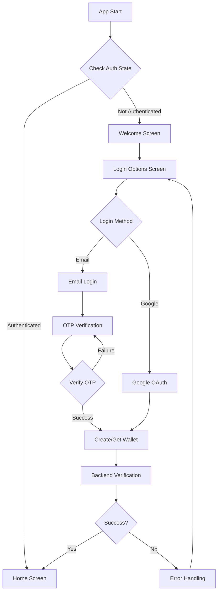
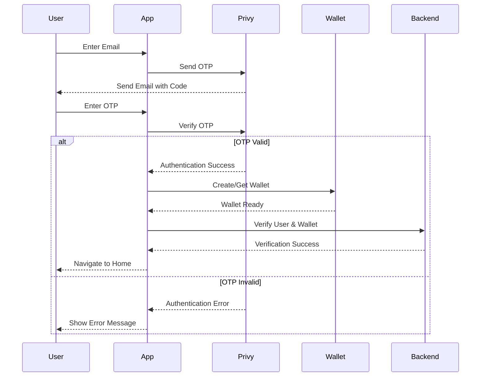
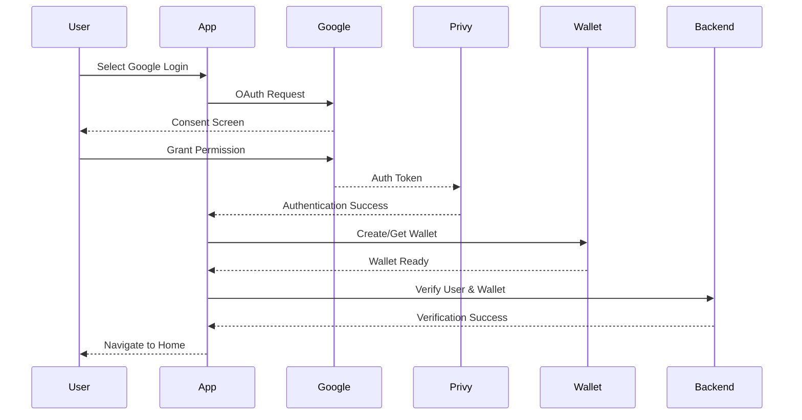

# Authentication System Rebuild Documentation

## Overview

This document outlines the plan for rebuilding the authentication system with a focus on modularity, maintainability, and future extensibility. The new system will abstract the authentication provider, allowing for future changes while maintaining a consistent interface throughout the application.

## Table of Contents

1. [Core Architecture](#1-core-architecture)
2. [Implementation Phases](#2-implementation-phases)
3. [Technical Specifications](#3-technical-specifications)
4. [State Management](#4-state-management)
5. [Feature Separation](#5-feature-separation)
6. [Migration Strategy](#6-migration-strategy)
7. [Testing Strategy](#7-testing-strategy)
8. [Documentation](#8-documentation)
9. [Future Roadmap](#9-future-roadmap)

# Authentication Flow Documentation

## 1. Flow Overview



## 2. Authentication States

```typescript
export enum AuthStatus {
  INITIAL = "INITIAL",
  AUTHENTICATING = "AUTHENTICATING",
  AUTHENTICATED = "AUTHENTICATED",
  ERROR = "ERROR",
}

export enum LoginStatus {
  INITIAL = "INITIAL",
  EMAIL_SEND = "EMAIL_SEND",
  EMAIL_ERROR = "EMAIL_ERROR",
  CODE_SUCCESS = "CODE_SUCCESS",
  CODE_ERROR = "CODE_ERROR",
  WALLET_CREATING = "WALLET_CREATING",
  WALLET_ERROR = "WALLET_ERROR",
  BACKEND_VERIFYING = "BACKEND_VERIFYING",
  BACKEND_ERROR = "BACKEND_ERROR",
}
```

## 3. Flow Sequences

### 3.1 Email Authentication Flow



### 3.2 Google Authentication Flow



## 4. Screen Flow States

### 4.1 Welcome Screen

- **State**: Initial
- **Actions**: Navigate to Login Options
- **Next**: Login Options Screen

### 4.2 Login Options Screen

- **State**: Choosing auth method
- **Actions**:
  - Select Email Login
  - Select Google Login
- **Next**: Email Login or Google OAuth

### 4.3 Email Login Screen

- **State**: Email input
- **Actions**:
  - Submit email
  - Validate email format
  - Send OTP
- **Next**: OTP Verification Screen

### 4.4 OTP Verification Screen

- **State**: OTP verification
- **Actions**:
  - Enter OTP
  - Verify OTP
  - Resend OTP
- **Next**: Wallet Creation/Home

## 5. Error Handling States

### 5.1 Email Authentication Errors

```typescript
export const emailAuthErrors = {
  INVALID_EMAIL: {
    code: "INVALID_EMAIL",
    message: "Please enter a valid email address",
    action: "STAY_ON_SCREEN",
  },
  OTP_SEND_FAILED: {
    code: "OTP_SEND_FAILED",
    message: "Failed to send verification code",
    action: "RETRY_ALLOWED",
  },
  OTP_INVALID: {
    code: "OTP_INVALID",
    message: "Invalid verification code",
    action: "RETRY_ALLOWED",
  },
  OTP_EXPIRED: {
    code: "OTP_EXPIRED",
    message: "Verification code expired",
    action: "RESEND_REQUIRED",
  },
};
```

### 5.2 Social Authentication Errors

```typescript
export const socialAuthErrors = {
  GOOGLE_AUTH_FAILED: {
    code: "GOOGLE_AUTH_FAILED",
    message: "Google authentication failed",
    action: "RETURN_TO_OPTIONS",
  },
  PERMISSION_DENIED: {
    code: "PERMISSION_DENIED",
    message: "Required permissions not granted",
    action: "RETURN_TO_OPTIONS",
  },
};
```

### 5.3 Wallet Errors

```typescript
export const walletErrors = {
  CREATION_FAILED: {
    code: "WALLET_CREATION_FAILED",
    message: "Failed to create wallet",
    action: "RETRY_ALLOWED",
  },
  CONNECTION_FAILED: {
    code: "WALLET_CONNECTION_FAILED",
    message: "Failed to connect wallet",
    action: "RETRY_ALLOWED",
  },
};
```

## 6. Loading States

### 6.1 Loading Messages

```typescript
export const loadingMessages = {
  SENDING_OTP: "Sending verification code...",
  VERIFYING_OTP: "Verifying code...",
  CREATING_WALLET: "Setting up your wallet...",
  CONNECTING_WALLET: "Connecting your wallet...",
  VERIFYING_USER: "Verifying your account...",
};
```

### 6.2 Loading States Management

```typescript
interface LoadingState {
  isLoading: boolean;
  message: string | null;
  progress?: number;
}

const useLoadingState = () => {
  const [loadingState, setLoadingState] = useState<LoadingState>({
    isLoading: false,
    message: null,
  });

  const startLoading = (message: string) => {
    setLoadingState({ isLoading: true, message });
  };

  const updateProgress = (progress: number) => {
    setLoadingState((state) => ({ ...state, progress }));
  };

  const stopLoading = () => {
    setLoadingState({ isLoading: false, message: null });
  };

  return { loadingState, startLoading, updateProgress, stopLoading };
};
```

## 7. Success States

### 7.1 Authentication Success

```typescript
interface AuthSuccess {
  user: AuthUser;
  wallet: WalletInfo;
  token: string;
}

const handleAuthSuccess = async (success: AuthSuccess) => {
  // Store auth data using the auth service
  await authService.storeToken(success.user.address, success.token);
  
  // Update user store
  setUser(success.user);
  
  // Navigate to home
  navigation.reset({
    index: 0,
    routes: [{ name: "Home" }],
  });
};
```

### 7.2 Success Analytics

```typescript
const trackAuthSuccess = (method: "email" | "google") => {
  analytics.track("auth_success", {
    method,
    timestamp: new Date().toISOString(),
    hasWallet: true,
  });
};
```

## 8. State Persistence

### 8.1 Storage Configuration
```typescript
import { MMKV } from 'react-native-mmkv';
import { StateStorage } from 'zustand/middleware';

export const storage = new MMKV();

const zustandStorage: StateStorage = {
  setItem: (name, value) => {
    return storage.set(name, value);
  },
  getItem: (name) => {
    const value = storage.getString(name);
    return value ?? null;
  },
  removeItem: (name) => {
    return storage.delete(name);
  },
  clear: () => {
    return storage.clearAll();
  },
};
```

### 8.2 Auth Store Implementation
```typescript
interface AuthState {
  token: string | null;
  user: AuthUser | null;
  wallet: WalletInfo | null;
  isLoading: boolean;
  error?: Error;
}

const initialState: AuthState = {
  token: null,
  user: null,
  wallet: null,
  isLoading: false,
  error: undefined,
};

export const createAuthStore = (queryClient: QueryClient) =>
  create<AuthStore>()(
    devtools(
      persist(
        (set, get) => ({
          ...initialState,
          setToken: (token: string) => set({ token }),
          setUser: (user: AuthUser) => set({ user }),
          setWallet: (wallet: WalletInfo) => set({ wallet }),
          setLoading: (isLoading: boolean) => set({ isLoading }),
          setError: (error?: Error) => set({ error }),
          reset: () => set(initialState),
          // Additional actions...
        }),
        {
          name: 'auth-storage',
          storage: createJSONStorage(() => zustandStorage),
        },
      ),
    ),
  );
```

### 8.3 Auth Service Integration
```typescript
class AuthService {
  private store: AuthStore;
  
  constructor(store: AuthStore) {
    this.store = store;
  }

  async storeAuthData(data: AuthSuccess) {
    this.store.setToken(data.token);
    this.store.setUser(data.user);
    this.store.setWallet(data.wallet);
  }

  async clearAuthData() {
    this.store.reset();
  }

  async getStoredToken(): Promise<string | null> {
    return this.store.getState().token;
  }
}
```

### 8.4 Usage Example
```typescript
const handleAuthSuccess = async (success: AuthSuccess) => {
  // Store auth data using the auth service
  await authService.storeAuthData(success);
  
  // Navigate to home
  navigation.reset({
    index: 0,
    routes: [{ name: 'Home' }],
  });
};
```

## 9. Implementation Guidelines

1. Always handle loading states with appropriate user feedback
2. Implement proper error handling with retry mechanisms
3. Use secure storage for sensitive data
4. Maintain proper state management throughout the flow
5. Implement analytics tracking at key points
6. Handle edge cases and network errors gracefully
7. Provide clear user feedback at each step
8. Implement proper validation at each step
9. Handle background/foreground app state changes
10. Implement proper cleanup on authentication failure

## 10. Testing Scenarios

1. Complete happy path for email authentication
2. Complete happy path for Google authentication
3. Various error scenarios for each step
4. Network error handling
5. Token expiration and refresh
6. Background/foreground transitions
7. Invalid input handling
8. Session recovery
9. Logout flow
10. Multiple authentication attempts

## 1. Core Architecture

### 1.1 Authentication Layer Abstraction

The core of the new authentication system is built around a provider interface that allows for different authentication implementations:

```typescript
interface IAuthProvider {
  isReady: boolean;
  isAuthenticated: boolean;
  user: AuthUser | null;
  login(params: AuthParams): Promise<void>;
  logout(): Promise<void>;
  getToken(): Promise<string | null>;
}

// Provider-specific implementation
class PrivyAuthProvider implements IAuthProvider {
  // Implementation specific to Privy
}

// Future implementations
class ClerkAuthProvider implements IAuthProvider {
  // Future implementation
}

class StytchAuthProvider implements IAuthProvider {
  // Future implementation
}
```

### 1.2 State Management Structure

The authentication state is managed through a Zustand store with clear typing:

```typescript
interface AuthState {
  status: "idle" | "authenticating" | "authenticated" | "error";
  user: AuthUser | null;
  error: Error | null;
  isReady: boolean;
  provider: IAuthProvider;
}

interface AuthActions {
  login(params: AuthParams): Promise<void>;
  logout(): Promise<void>;
  setUser(user: AuthUser | null): void;
  setError(error: Error | null): void;
  setStatus(status: AuthState["status"]): void;
}
```

## 2. Implementation Phases

### Phase 1: Core Authentication Infrastructure (Week 1)

- Setup authentication provider abstraction
- Implement Privy adapter
- Create base authentication hooks
- Establish authentication context

### Phase 2: State Management and Flow Control (Week 1-2)

- Implement enhanced Zustand store
- Create authentication flow controllers
- Set up error handling system
- Implement loading states

### Phase 3: Feature Separation (Week 2)

- Separate wallet creation flow
- Decouple KYC verification
- Create feature flags system
- Implement feature-based routing

### Phase 4: Testing and Documentation (Week 3)

- Write unit tests for core functionality
- Create integration tests
- Document architecture
- Create usage examples

## 3. Technical Specifications

### 3.1 Directory Structure

```
src/
  auth/
    providers/
      base.ts         # Base authentication interface
      privy.ts        # Privy implementation
      index.ts        # Provider exports
    store/
      auth.store.ts   # Authentication state
      types.ts        # Store types
    hooks/
      useAuth.ts      # Main authentication hook
      useAuthState.ts # State management hook
    context/
      AuthContext.tsx # Authentication context
    components/
      AuthProvider.tsx    # Main provider component
      AuthGuard.tsx      # Route protection
      LoginFlow.tsx      # Login flow component
    utils/
      errors.ts      # Error handling utilities
      constants.ts   # Authentication constants
```

### 3.2 Core Components Design

#### AuthProvider Component

```typescript
interface AuthProviderProps {
  provider: IAuthProvider;
  children: React.ReactNode;
}

const AuthProvider: React.FC<AuthProviderProps> = ({ provider, children }) => {
  // Provider implementation
};
```

#### Authentication Hook

```typescript
interface UseAuthReturn {
  isAuthenticated: boolean;
  isLoading: boolean;
  user: AuthUser | null;
  login: (params: AuthParams) => Promise<void>;
  logout: () => Promise<void>;
  error: Error | null;
}

const useAuth = (): UseAuthReturn => {
  // Hook implementation
};
```

## 4. State Management

### 4.1 Simplified Auth Store

```typescript
interface AuthState {
  user: PrivyUser | null;
  isLoading: boolean;
  error?: Error;
}

const useAuthStore = create<AuthState>((set) => ({
  user: null,
  isLoading: false,
  error: undefined,
  
  setUser: (user: PrivyUser | null) => set({ user }),
  setLoading: (isLoading: boolean) => set({ isLoading }),
  setError: (error?: Error) => set({ error }),
  reset: () => set({ user: null, isLoading: false, error: undefined }),
}));

// Hook to access auth state
export const useAuth = () => {
  const { user } = usePrivy(); // Use Privy's built-in hook
  const store = useAuthStore();

  // Update local store when Privy user changes
  useEffect(() => {
    store.setUser(user);
  }, [user]);

  return {
    isAuthenticated: !!user,
    user,
    isLoading: store.isLoading,
    error: store.error,
  };
};
```

### 4.2 Error Handling

```typescript
class AuthError extends Error {
  constructor(
    message: string,
    public code: string,
    public metadata?: Record<string, unknown>,
  ) {
    super(message);
  }
}

const handleAuthError = (error: unknown): AuthError => {
  // Error handling implementation
  if (error instanceof AuthError) {
    return error;
  }
  
  return new AuthError(
    'An unexpected error occurred',
    'AUTH_ERROR',
    { originalError: error }
  );
};
```

## 5. Feature Separation

### 5.1 Wallet Integration

```typescript
interface WalletFeature {
  isEnabled: boolean;
  requiresAuth: boolean;
  onAuthSuccess?: (user: AuthUser) => Promise<void>;
}

const createWalletFeature = (): WalletFeature => {
  // Wallet feature implementation
};
```

### 5.2 KYC Integration

```typescript
interface KYCFeature {
  isEnabled: boolean;
  requiresAuth: boolean;
  requiresWallet?: boolean;
  onAuthSuccess?: (user: AuthUser) => Promise<void>;
}

const createKYCFeature = (): KYCFeature => {
  // KYC feature implementation
};
```

## 6. Migration Strategy

### 6.1 Phase-wise Migration

1. Implement new authentication infrastructure
2. Create adapters for existing functionality
3. Gradually migrate features to new system
4. Remove old implementation

### 6.2 Rollback Plan

- Maintain feature flags for quick rollback
- Keep old implementation until new system is stable
- Document migration steps for reversal if needed

## 7. Testing Strategy

### 7.1 Unit Tests

```typescript
describe("AuthProvider", () => {
  // Test cases for auth provider
});

describe("useAuth", () => {
  // Test cases for auth hook
});

describe("AuthStore", () => {
  // Test cases for auth store
});
```

### 7.2 Integration Tests

```typescript
describe("Authentication Flow", () => {
  // Test complete authentication flow
});

describe("Feature Integration", () => {
  // Test integration with wallet and KYC
});
```

## 8. Documentation

Required documentation includes:

1. Architecture Overview
2. Provider Implementation Guide
3. Migration Guide
4. Testing Guide
5. Security Considerations
6. Feature Integration Guide

## 9. Future Roadmap

The following features are planned for future implementation:

1. Multi-Factor Authentication (MFA)

   - Implementation of hardware security keys (FIDO2/WebAuthn)
   - Additional second-factor options

2. Security Enhancements

   - PKCE Implementation for OAuth flows
   - Enhanced token management system
   - Automatic token refresh mechanism

3. Provider Integration

   - Clerk authentication provider
   - Stytch authentication provider

4. Advanced Features
   - Offline authentication support
   - Enhanced session management
   - Advanced security monitoring

## Implementation Guidelines

### Code Style and Standards

1. Use TypeScript for all new code
2. Maintain strict type checking
3. Follow React best practices
4. Document all public interfaces
5. Write unit tests for all new functionality

### Security Considerations

1. Secure storage of authentication tokens
2. Protection against common attack vectors
3. Proper error handling and logging
4. Secure communication with authentication providers

### Performance Considerations

1. Minimize authentication latency
2. Optimize state updates
3. Implement proper loading states
4. Cache authentication state appropriately

## Login Flow and UI Components

### 1. Screen Architecture

```typescript
// Screen types for type-safe navigation
export type AuthStackParamList = {
  Welcome: undefined;
  Login: undefined;
  EmailLogin: undefined;
  OTPVerification: { email: string };
  SocialLogin: undefined;
  LoginSuccess: undefined;
};

// Navigation configuration
const AuthStack = createStackNavigator<AuthStackParamList>();
```

### 2. Screen Components

#### 2.1 Welcome Screen

```typescript
interface WelcomeScreenProps {
  navigation: AuthNavigationProp;
}

const WelcomeScreen: React.FC<WelcomeScreenProps> = ({ navigation }) => {
  const { t } = useTranslation();

  const loginWithOptions = () => {
    navigation.navigate("LoginScreen");
  };

  // Enable CSS interop for SVG components
  cssInterop(LogoLetter, { className: "style" });

  return (
    <SafeAreaView className="flex-1 justify-start items-stretch bg-basic-black">
      <View className="flex flex-1 justify-between items-stretch px-layout">
        {/* Logo and Gradient Section */}
        <View className="relative flex justify-center items-center w-full">
          <GradientCircle className="relative" />
          <View className="absolute flex justify-center items-center">
            <Logo className="absolute top-1/2 left-1/2 -translate-x-1/2 -translate-y-1/2 w-12 h-12" />
          </View>
        </View>

        {/* Content Section */}
        <View className="flex-1 flex justify-between">
          {/* App Description */}
          <View className="flex flex-1 justify-center items-center gap-6">
            <LogoLetter className="h-8 w-full" />
            <View>
              <Text className="caption-xl text-gray-50 text-center">
                {t("login.description_line_1")}
              </Text>
              <Text className="caption-xl text-gray-50 text-center">
                {t("login.description_line_2")}
              </Text>
            </View>
          </View>

          {/* Login Button */}
          <View className="flex items-stretch justify-start gap-buttons">
            <Button onPress={loginWithOptions} className="w-full">
              <Text className="button-m">{t("login.signUpButton")}</Text>
            </Button>
          </View>
        </View>
      </View>
    </SafeAreaView>
  );
};
```

Required imports:

```typescript
import GradientCircle from "@/assets/zeneca-gradient-circle.svg";
import Logo from "@/assets/zeneca-logo-bright.svg";
import LogoLetter from "@/assets/zeneca-logo-letters.svg";
import Button from "@/components/Button";
import { useNavigation } from "@react-navigation/native";
import { cssInterop } from "nativewind";
import { useTranslation } from "react-i18next";
import { SafeAreaView, Text, View } from "react-native";
```

#### 2.2 Login Screen

```typescript
interface LoginScreenProps {
  navigation: AuthNavigationProp;
}

const LoginScreen: React.FC<LoginScreenProps> = ({ navigation }) => {
  const { login } = useAuth();

  const handleSocialLogin = async (provider: 'google' | 'apple') => {
    try {
      await login({ provider });
      navigation.navigate('LoginSuccess');
    } catch (error) {
      // Error handling
    }
  };

  return (
    <SafeAreaView className="flex-1 bg-background">
      <View className="flex-1 justify-center px-4">
        <View className="space-y-4">
          <SocialButton
            provider="google"
            onPress={() => handleSocialLogin('google')}
          />
          <SocialButton
            provider="apple"
            onPress={() => handleSocialLogin('apple')}
          />
          <Divider text="or" />
          <Button
            variant="outline"
            onPress={() => navigation.navigate('EmailLogin')}
          >
            Continue with Email
          </Button>
        </View>
      </View>
    </SafeAreaView>
  );
};
```

#### 2.3 Email Login Screen

```typescript
interface EmailLoginScreenProps {
  navigation: AuthNavigationProp;
}

const EmailLoginScreen: React.FC<EmailLoginScreenProps> = ({ navigation }) => {
  const [email, setEmail] = useState('');
  const { sendOTP } = useAuth();

  const handleSubmit = async () => {
    try {
      await sendOTP(email);
      navigation.navigate('OTPVerification', { email });
    } catch (error) {
      // Error handling
    }
  };

  return (
    <SafeAreaView className="flex-1 bg-background">
      <View className="flex-1 justify-center px-4">
        <Input
          label="Email Address"
          value={email}
          onChangeText={setEmail}
          keyboardType="email-address"
          autoCapitalize="none"
        />
        <Button
          onPress={handleSubmit}
          variant="primary"
          disabled={!isValidEmail(email)}
        >
          Continue
        </Button>
      </View>
    </SafeAreaView>
  );
};
```

### 3. Reusable UI Components

#### 3.1 Social Login Button

```typescript
interface SocialButtonProps {
  provider: 'google' | 'apple';
  onPress: () => void;
}

const SocialButton: React.FC<SocialButtonProps> = ({ provider, onPress }) => {
  const icon = provider === 'google' ? GoogleIcon : AppleIcon;
  const text = `Continue with ${capitalize(provider)}`;

  return (
    <Button
      variant="outline"
      onPress={onPress}
      leftIcon={icon}
      className="bg-white"
    >
      {text}
    </Button>
  );
};
```

#### 3.2 OTP Input Component

```typescript
interface OTPInputProps {
  length?: number;
  value: string;
  onChange: (value: string) => void;
}

const OTPInput: React.FC<OTPInputProps> = ({
  length = 6,
  value,
  onChange
}) => {
  return (
    <View className="flex-row justify-between w-full">
      {Array.from({ length }).map((_, index) => (
        <View
          key={index}
          className="w-12 h-12 border rounded-lg justify-center items-center"
        >
          <Text className="text-2xl">{value[index] || ''}</Text>
        </View>
      ))}
    </View>
  );
};
```

### 4. Authentication Flow Logic

#### 4.1 Flow Controller

```typescript
interface AuthFlowController {
  currentStep: AuthStep;
  user: AuthUser | null;
  error: Error | null;

  startAuthentication(): Promise<void>;
  handleSocialLogin(provider: string): Promise<void>;
  handleEmailLogin(email: string): Promise<void>;
  verifyOTP(otp: string): Promise<void>;
  completeAuthentication(): Promise<void>;
}

const useAuthFlow = (): AuthFlowController => {
  const [currentStep, setCurrentStep] = useState<AuthStep>("initial");
  const { login, user, error } = useAuth();

  // Implementation
};
```

#### 4.2 Navigation Guard

```typescript
const AuthNavigationGuard: React.FC = ({ children }) => {
  const { isAuthenticated, isLoading } = useAuth();
  const navigation = useNavigation();

  useEffect(() => {
    if (!isLoading && !isAuthenticated) {
      navigation.reset({
        index: 0,
        routes: [{ name: 'Welcome' }],
      });
    }
  }, [isAuthenticated, isLoading]);

  if (isLoading) {
    return <LoadingScreen />;
  }

  return <>{children}</>;
};
```

### 5. Styling Guidelines

#### 5.1 Theme Configuration

```typescript
export const authTheme = {
  colors: {
    primary: "#007AFF",
    background: "#F8F9FA",
    text: "#1C1C1E",
    error: "#FF3B30",
    border: "#E5E5EA",
  },
  spacing: {
    xs: 4,
    sm: 8,
    md: 16,
    lg: 24,
    xl: 32,
  },
  borderRadius: {
    sm: 4,
    md: 8,
    lg: 12,
    full: 9999,
  },
};
```

#### 5.2 Common Styles

```typescript
export const authStyles = {
  container: "flex-1 bg-background",
  card: "bg-white rounded-lg p-4 shadow-sm",
  input: "h-12 px-4 border rounded-lg",
  button: {
    base: "h-12 rounded-lg justify-center items-center",
    primary: "bg-primary",
    outline: "border border-border",
    disabled: "opacity-50",
  },
};
```

### 6. Error Handling and Feedback

#### 6.1 Error Messages

```typescript
export const authErrorMessages = {
  invalidEmail: "Please enter a valid email address",
  invalidOTP: "Invalid verification code",
  socialLoginFailed: "Social login failed. Please try again",
  networkError: "Network error. Please check your connection",
  unknownError: "An unexpected error occurred",
};
```

#### 6.2 Toast Notifications

```typescript
interface ToastConfig {
  message: string;
  type: "success" | "error" | "info";
  duration?: number;
}

const showToast = (config: ToastConfig) => {
  // Implementation
};
```

### 7. Analytics and Tracking

```typescript
interface AuthAnalytics {
  trackScreenView(screen: keyof AuthStackParamList): void;
  trackLoginAttempt(provider: string): void;
  trackLoginSuccess(provider: string): void;
  trackLoginError(provider: string, error: Error): void;
}

const useAuthAnalytics = (): AuthAnalytics => {
  // Implementation
};
```

## Conclusion

This rebuild plan provides a solid foundation for a modular, maintainable, and secure authentication system. The abstracted provider interface ensures that the system can evolve with changing requirements while maintaining a consistent interface for the application.

The phase-wise implementation approach allows for careful testing and validation at each step, while the comprehensive testing strategy ensures the reliability of the new system. The documentation requirements ensure that the system is well-understood and maintainable by the development team.
