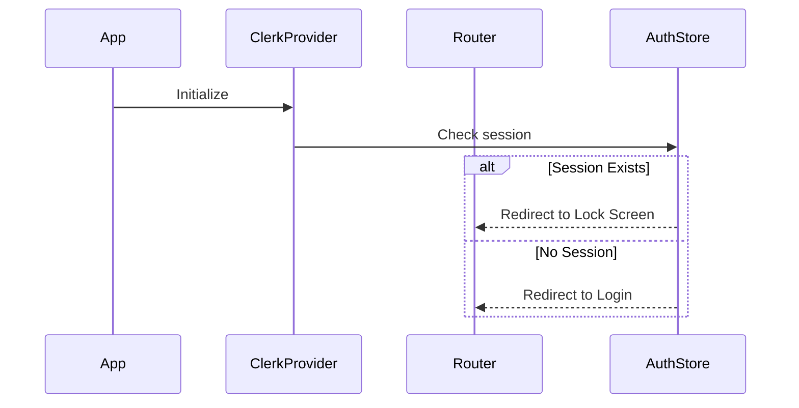

# Authentication Flow Documentation

## Overview
The Zeneca Mobile app uses Clerk for authentication, with support for both email and Google OAuth sign-in methods. The authentication flow is integrated with wallet creation and management, ensuring users have both authentication and blockchain capabilities.

## Components and Dependencies

### Core Technologies
- **Clerk**: Primary authentication provider
- **Expo Router**: Navigation and routing
- **React Native**: Mobile framework
- **Secure Store**: Token storage
- **MMKV**: Local storage for app state
- **Local Authentication**: Biometric and PIN authentication

### Key Files
- `app/_layout.tsx`: Main authentication flow and route protection
- `app/login.tsx`: Login screen
- `app/signup.tsx`: Sign up screen
- `app/email-signup.tsx`: Email-based signup
- `app/verify/[email].tsx`: Email verification
- `context/UserInactivity.tsx`: Session management
- `app/(authenticated)/modals/lock.tsx`: Authentication lock screen

## Authentication Flow

### 1. Initial App Load


### 2. Sign Up Flow

#### Email Sign Up
1. User selects email sign up option
2. Enters email address
3. System sends verification code
4. User enters verification code
5. On successful verification:
   - Creates user session
   - Redirects to authenticated section

#### Google OAuth Sign Up
1. User selects Google sign up
2. OAuth flow initiated
3. On successful authentication:
   - Creates user session
   - Stores authentication token
   - Redirects to authenticated section

### 3. Login Flow

#### Email Login
1. User enters email
2. System sends verification code
3. User verifies code
4. On success:
   - Creates session
   - Stores authentication token
   - Redirects to authenticated section

#### Google OAuth Login
1. User selects Google login
2. Completes OAuth flow
3. On success:
   - Creates session
   - Stores authentication token
   - Redirects to authenticated section

### 4. Session Management

#### Route Protection
```typescript
useEffect(() => {
    if (!isLoaded) return;

    const inAuthGroup = segments[0] === '(authenticated)';
    const isAuthenticated = isSignedIn;

    if (isAuthenticated && !inAuthGroup) {
        router.replace('/(authenticated)/modals/lock');
    } else if (!isAuthenticated && inAuthGroup) {
        router.replace('/');
    }
}, [isSignedIn]);
```

#### Inactivity Management
- Monitors app state changes
- Locks app when:
  - App goes to background
  - User inactivity timeout
- Requires biometric/PIN authentication to unlock

### 5. Security Features

#### Biometric Authentication
- Integrated with expo-local-authentication
- Supports fingerprint and face recognition
- Falls back to PIN authentication

#### Token Management
- Secure token storage using Secure Store
- Token refresh handling
- Session persistence

#### Protected Routes
- All routes under `(authenticated)` group are protected
- Automatic redirection to login for unauthenticated access
- Lock screen protection for background/inactive state

## Error Handling

### Authentication Errors
- Invalid credentials
- Network failures
- Verification code errors
- OAuth failures

### Error Response Format
```typescript
if (isClerkAPIResponseError(err)) {
    Alert.alert('Error', err.errors[0].message);
}
```

## Testing

### Test Categories
1. Authentication Flow Tests
2. Route Protection Tests
3. Session Management Tests
4. Error Handling Tests

### Example Test Cases
```typescript
describe('Authentication Guards', () => {
    it('should redirect unauthenticated users to login');
    it('should allow authenticated users to access protected routes');
    it('should handle session expiration');
    it('should manage biometric authentication');
});
```

## Best Practices

1. **Security**
   - Secure token storage
   - Biometric authentication
   - Route protection
   - Session management

2. **User Experience**
   - Smooth authentication flow
   - Clear error messages
   - Multiple auth options
   - Persistent sessions

3. **Code Organization**
   - Modular authentication components
   - Centralized auth state
   - Clear routing structure
   - Consistent error handling 